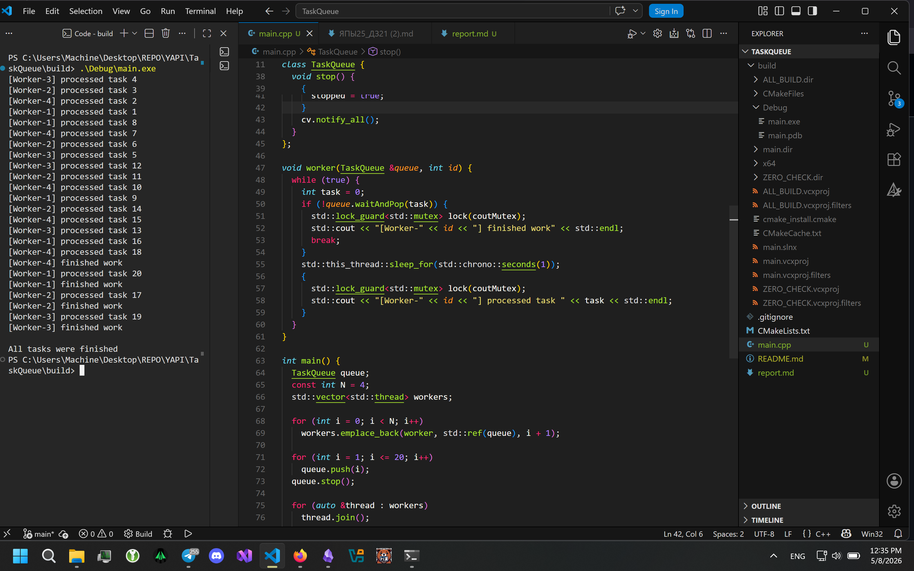

# Домашнее задание №1  
## Тема: Многопоточность в C++

---

# 1. Титульная информация

**ФИО:** Тюшин Кирилл Сергеевич  
**Группа:** СКБ252  
**Дисциплина:** Языки программирования 
**Тема работы:** Многопоточность в C++

---

# 2. Постановка задачи

Необходимо было реализовать консольное приложение на языке C++, моделирующее обработку задач несколькими потоками.

ТЗ:
- создать потокобезопасную очередь задач;
- реализовать рабочие потоки;
- использовать `std::mutex` и `std::condition_variable`;
- обеспечить корректное завершение потоков.

---

# 3. Описание реализации

В программе был реализован класс `TaskQueue`, который хранит очередь задач `int`.

Для синхронизации доступа к очереди используется `std::mutex`.  
Чтобы потоки не выполняли постоянную проверку очереди, используется `std::condition_variable`.

## Добавление задач

Метод `push()` добавляет задачу в очередь и уведомляет один ожидающий поток через `notify_one()`.

## Извлечение задач

Метод `waitAndPop()` ожидает появления задач в очереди с помощью:

```cpp
cv.wait(lock, [this]() { return !tasks.empty() || stopped; });
```

После появления задачи поток получает её и продолжает выполнение.

## Рабочие потоки

Было создано 4 рабочих потока.  
Каждый поток:
- получает задачу из очереди;
- обрабатывает её 1 секунду;
- выводит сообщение в консоль.

Для корректного вывода сообщений используется `mutex` (`coutMutex`).

## Завершение потоков

Для остановки потоков используется флаг `stopped`.

После добавления всех задач главный поток вызывает метод `stop()`, который:
- устанавливает флаг остановки;
- будит все ожидающие потоки через `notify_all()`.

После этого главный поток ожидает завершения всех рабочих потоков с помощью `join()`.

---

# 4. Демонстрация работы

## GitHub

https://github.com/Korl1207/HW21

## ScreenShot



---

# 5. Выводы

В ходе выполнения работы были изучены основы многопоточности в C++.

Были использованы:
- `std::thread`
- `std::mutex`
- `std::condition_variable`

Также был рассмотрен механизм синхронизации потоков и безопасной работы с общими ресурсами.
